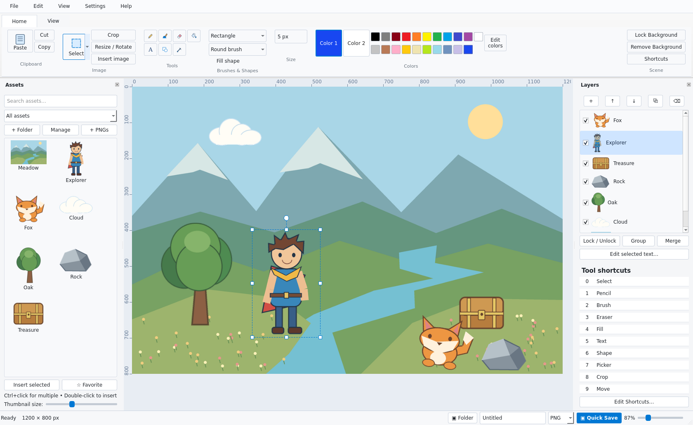

# GradeA PaintPlus

An offline Windows desktop image and scene editor with a familiar Paint-style
ribbon, better object transformations, reusable PNG assets, simple layers and
Quick Save. This is an independent application, not affiliated with Microsoft.



## For users

Get the installer from [GitHub Downloads](https://github.com/RicFlairIsMyGrandad/GradeA_MSPaint/releases/tag/v0.1.0-preview), scan it with Windows
Security if desired, then double-click it and follow the installer. Launch
**GradeA PaintPlus** from the desktop or Start menu. The installer includes the
runtime and offline AI model: no Python, command prompt, account or internet is
needed. Windows 10/11 x64 is the target; ARM and 32-bit builds are not supplied.

This first release is a **preview**, not a signed production release. Windows may
show an “unknown publisher” or SmartScreen warning because it is unsigned. Do not
turn off security software. Only proceed if you trust where the file came from;
otherwise cancel. Checksums are in `SHA256SUMS.txt` beside the downloads. A hash
checks file identity; it is not an antivirus verdict.

The portable ZIP contains **Launch PaintPlus.vbs** for double-click launching.
Extract the whole ZIP first. Some managed PCs disable Windows Script Host; on
those PCs use the installer and its normal shortcuts instead.

See [the user guide](docs/USER_GUIDE.md) and [current limitations](docs/STATUS.md).
The full source, build scripts and tests are in this Git project. Editable
`.paintplus` files preserve original image pixels, layers, object transforms,
groups and text. PNG/JPEG exports are flattened.

## Development

Python 3.12 is the tested development runtime. These instructions are for
contributors; end users do not need to run them.

```sh
python -m venv .venv
# Windows: .venv\Scripts\activate
# Linux/macOS: source .venv/bin/activate
python -m pip install -e '.[test,ai]'
python packaging/fetch_model.py
python -m paintplus
python -m pytest -q
```

Linux headless tests use `QT_QPA_PLATFORM=offscreen`. A Qt-capable graphical
session is needed for interactive development. The app itself makes no network
requests; only dependency installation and build-time model fetching do.

See [Windows build instructions](docs/BUILD.md), [architecture](docs/ARCHITECTURE.md)
and [offline AI details](docs/BACKGROUND_REMOVAL.md). Windows CI runs tests,
assembles the same runtime, tests the packaged app, and creates installer and
portable artifacts with SHA-256 checksums. Successful main-branch CI builds publish preview downloads to GitHub Releases.

## License

Application source: MIT. Third-party runtime/model licenses are listed in
[THIRD_PARTY_NOTICES.md](THIRD_PARTY_NOTICES.md) and retained in distributions.
